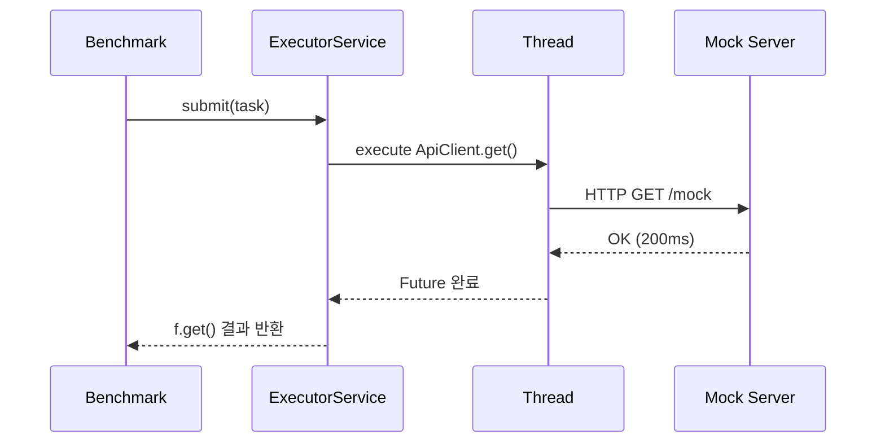

# java-thread-notes

## 📌 레포 개요

이 레포는 자바 쓰레드 학습 기록을 정리하기 위한 공간입니다.
특히 자바의 정석 4판에서 본격적으로 다루기 시작한 가상 쓰레드(Virtual Thread) 개념을 계기로,

> 멀티스레드와 동시성 프로그래밍은 앞으로 성능 확장의 핵심이다

라고 판단해 체계적으로 실습하고 기록하고자 만들었습니다.

단순 이론 정리를 넘어서,
### 📌 직접 코드로 실험하고 문제를 해결하는 과정 자체를 기록하는 것을 목표로 합니다.

---
## 🎯 학습 목표

- 기본 쓰레드 생성 및 실행 (Thread, Runnable, Callable)

- 쓰레드 제어 기초 (sleep, join, interrupt)

- 동기화 (synchronized, ReentrantLock, wait/notify)

- Executor Framework (FixedThreadPool, CachedThreadPool)

- Virtual Thread (newVirtualThreadPerTaskExecutor)

- CPU-bound / IO-bound 분류와 전략

- 실전 API 호출 테스트로 동시성 이해

- Virtual vs Platform 쓰레드 성능 실험

---

## 📝 기록 방식
```text
/src
/virtual_thread       → 가상 쓰레드 예제
/platform_thread      → 기존 쓰레드 예제
/benchmark            → 실제 성능 실험 코드
/utils                → StopWatch, ApiClient 등 공통 유틸
/notes
→ 실험 결과 및 트러블슈팅 기록
README.md
```

## 🚀 앞으로의 방향

- 기존 플랫폼 스레드와 가상 스레드의 성능 비교 정리

- IO-bound 상황에서 가상 스레드의 장점 실험

- WAS(Tomcat) + Virtual Thread 연동 실험

- 실전 프로젝트에 접목할 패턴 연구

- JMH 기반 벤치마크도 도입 예정

---

## ⚡ Virtual Thread & Platform Thread 성능 실험 정리

아래 내용은 실제로 테스트하면서 발생한 문제, 원인, 해결 과정 등을
정확한 기록 형태로 정리한 것입니다.

---

## 📍 실험 목표

- 동일한 API 엔드포인트에 대량 요청을 보내고 Virtual Thread와 Platform Thread의 성능 차이를 확인한다.

- 동시성 증가 시 어떤 문제가 발생하는지 체험한다.

- Virtual Thread의 한계점(특히 OS 자원 측면)을 이해한다.

---

## 📡 실험 환경
| 항목                       | 값                                   |
| ------------------------ | ----------------------------------- |
| JDK                      | 21                                  |
| SpringBoot mock server   | /mock (200ms sleep)                 |
| API 클라이언트                | `HttpClient`                        |
| Virtual Thread Executor  | `newVirtualThreadPerTaskExecutor()` |
| Platform Thread Executor | `newFixedThreadPool(200)`           |

---

## ❗ 트러블슈팅 기록
### ❗ 문제 1: Virtual Thread가 10,000 요청에서 터짐
✔ 증상
```text
CALL_COUNT = 10,000 이상에서
java.net.ConnectException, ClosedChannelException 발생.
```

✔ 원인
```text
1. Virtual Thread는 매우 빠르게 다량의 "동시 connect()"를 수행한다.
2. 그러나 OS의 Ephemeral Port는 개수가 한정되어 있고,
3. 포트 재사용까지 수 초~수 분이 걸린다.
4. 너무 많은 connect()가 동시에 시도되면
    → 포트 고갈 발생
    → ConnectException 발생
```

✔ 핵심 결론

Virtual Thread는 빠르지만 네트워크(포트) 제한을 초과하면 터진다.

---

### ❗ 문제 2: Platform Thread는 되는데 Virtual Thread만 터짐

```text
Platform Thread의 쓰레드풀은 200개.
→ 동시 connect() 시도가 200개로 제한됨.

Virtual Thread는 사실상 무제한 생성됨.
→ 동시 connect()가 수천 개가 됨.

✔ 동시 TCP 충돌의 규모 자체가 달라서
Virtual Thread가 먼저 터지는 것이 정상이다.
```
---
## 🔧 해결: Batch 처리 전략

Virtual Thread에서 포트 고갈을 피하는 가장 간단한 해결책은 배치로 나누는 것이다.

예)

6000개 × 10번 → 총 60000 요청

배치 사이에 포트가 반납될 시간이 생긴다.

---

## ✔ 배치 구조 코드
```java
for (int batch = 0; batch < BATCH_COUNT; batch++) {

    List<Future<String>> futures = new ArrayList<>();

    for (int i = 0; i < BATCH_SIZE; i++) {
        futures.add(executor.submit(() -> ApiClient.get(URL)));
    }

    for (Future<String> f : futures) {
        f.get();
    }

    System.out.println("Batch " + (batch + 1) + " 완료");
}

```
---
## ⏱ StopWatch 적용 (리팩토링)

기존 System.currentTimeMillis() 대신 직접 만든 StopWatch 클래스로 성능 측정 간소화.
```java
StopWatch sw = StopWatch.startNew();
...
sw.stop();
System.out.println("Total: " + sw.getElapsedMillis());

```
---

## 📊 Virtual vs Platform 성능 비교 결과
| 항목       | Platform Thread | Virtual Thread   |
| -------- | --------------- | ---------------- |
| 동시 요청 처리 | 쓰레드풀에 의해 제한     | 사실상 무제한          |
| 속도       | 상대적으로 느림        | 매우 빠름            |
| 실패 가능성   | 낮음              | 포트 고갈로 실패 가능     |
| 해결책      | 필요 없음           | Batch 필수         |
| 총 처리량    | 낮음              | Batch 적용 시 매우 높음 |

---

## 🔍 테스트 흐름 다이어그램
### 1) 성능 측정 전체 흐름

---

### 2) Virtual Thread Batch 흐름

```mermaid
   flowchart TD

A[Start] --> B{Batch 반복}
B -->|1| C[6000개 요청 생성]
C --> D[future.get()로 대기]
D --> E[Batch 완료 출력]
E --> B
B -->|끝| F[Total 시간 측정]
```
---
## 📎 참고 파일 요약
| 파일명                        | 역할                              |
| -------------------------- | ------------------------------- |
| `ApiClient`                | HttpClient GET 요청               |
| `StopWatch`                | 성능 측정 유틸                        |
| `VirtualApiBatchTest`      | Batch 기반 Virtual Thread 부하 테스트  |
| `PlatformApiBatchTest`     | Batch 기반 Platform Thread 부하 테스트 |
| `VirtualApiPerRequestTest` | 개별 요청 시간 측정용                    |
| `CsvLogger`                | 그래프 분석용 CSV export              |

---
## 🎉 마무리

이 레포는 단순히 쓰레드를 배우는 공간이 아니라,  실제로 문제를 만나고 해결하면서 동시성을 이해하는 학습 기록을 남기는 공간이다.

Virtual Thread는 "빠르다"만 알고 있으면 절반만 아는 것이다.
실제로 테스트해보면, 빠른 만큼 OS 리소스를 너무 빠르게 소모해버릴 수도 있다.

이번 레포는 이것을 몸으로 이해한 중요한 기록이라고 생각한다.

추가로,

1. JMH 벤치마킹

2. Tomcat + Virtual Thread 실험

3. DB Pool + Virtual Thread 실험


까지 확장해서 이 레포를 완성할 예정이다.